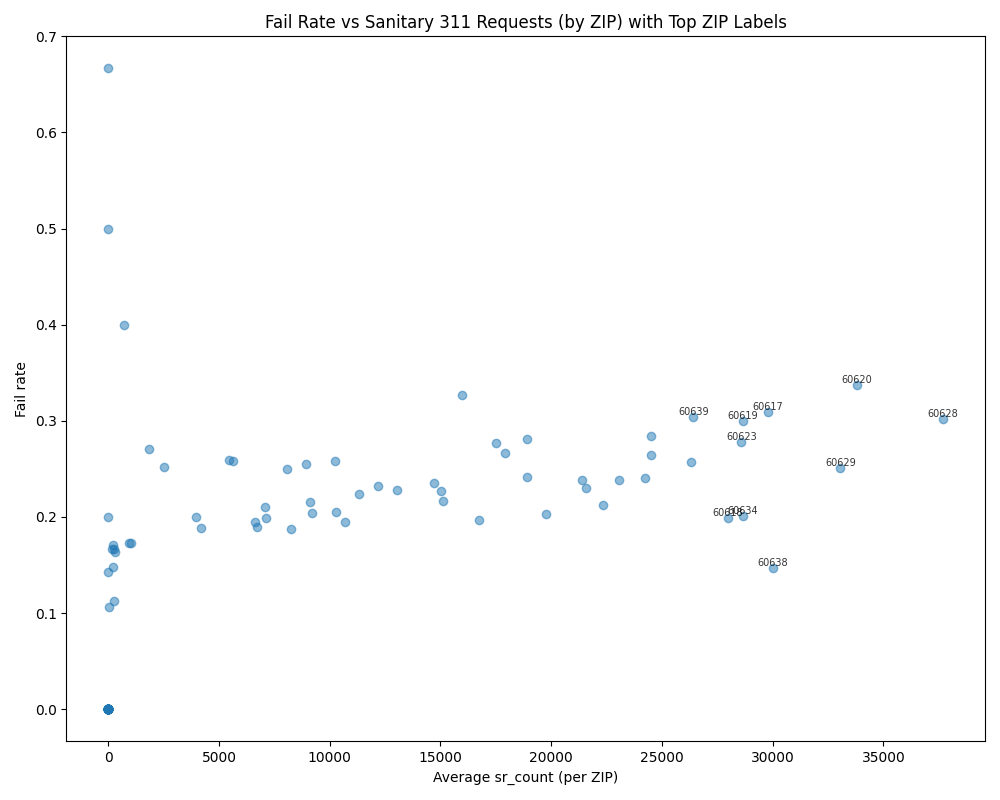
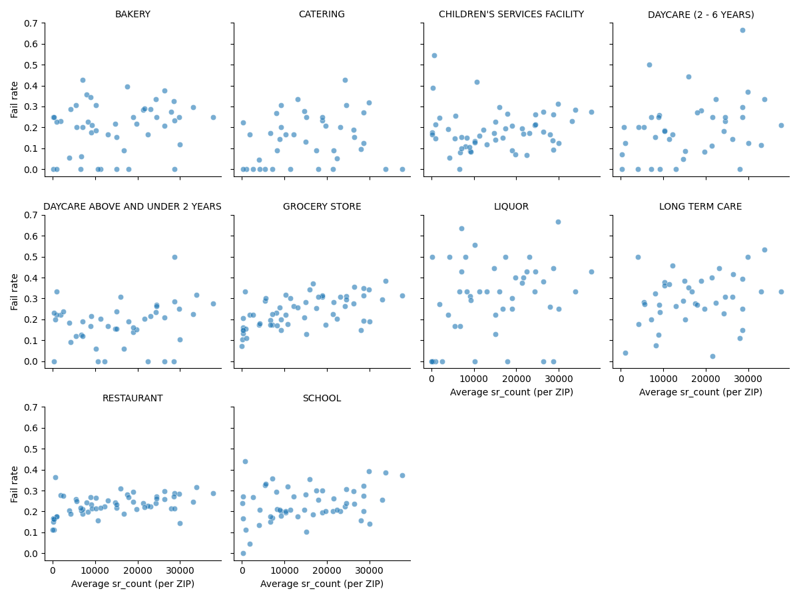
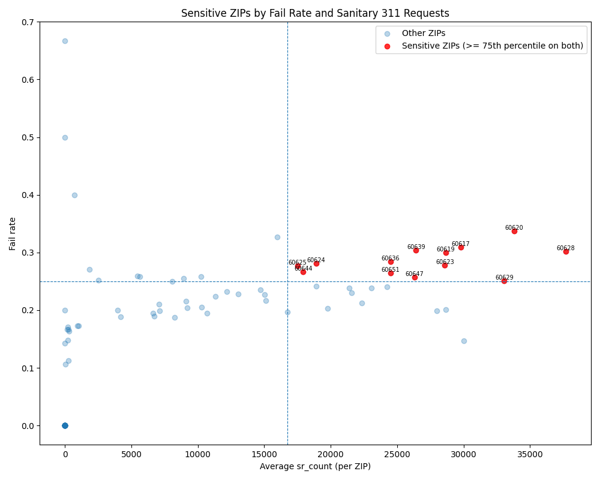
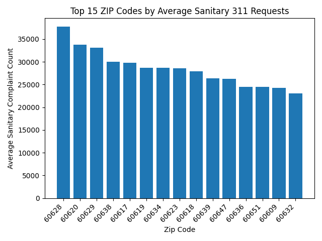
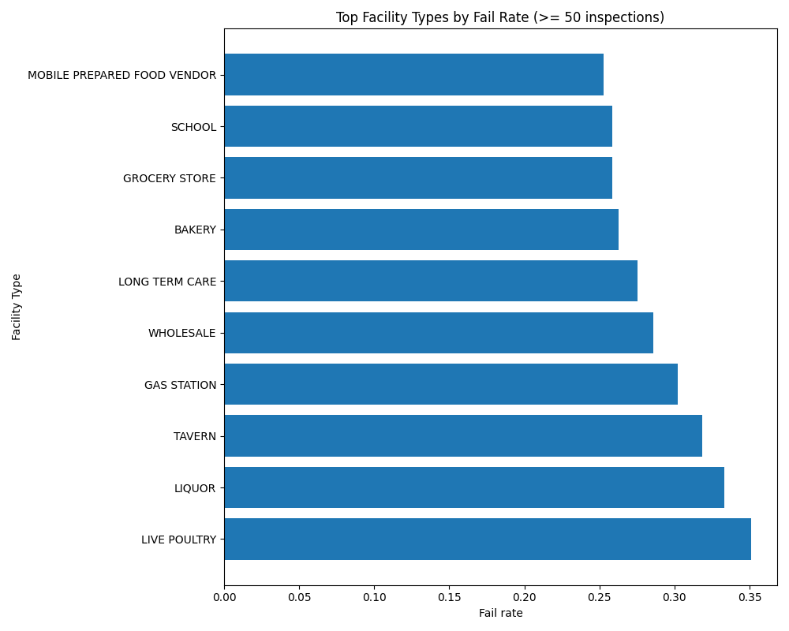

# Are Chicagoans Secret Food Safety Inspectors? Analyzing Chicago's Food Inspection and 311-reported Sanitary Complaints Data

## Contributors
<h3>Sean Yoon</h3>
    <ul>
        <li>Managed GitHub repository</li>
        <li>Integrated and cleaned datasets</li>
        <li>Created Snakefile for workflow management</li>
        <li>Wrote data analysis and visualization scripts</li>
    </ul>
<h3>Nathan Diaz</h3>
    <ul>
        <li>Written protion of Data Quality</li>
        <li>Findings</li>
        <li>Future Work</li>
        <li></li>Refrences</li>
    </ul>
        

## Summary
What comes to your mind when you think about Chicago? Skyscraper? Jazz and blues music? The musical? These are all great representations of Chicago. Yet, Chicago has a strong culinary identity; it is renowned for having exceptional and diverse restaurants, even has a dish named after its city: Chicago-style pizza. While serving delicious food is crucial to becoming a city of appetite, sanitation around food places is as important. The City of Chicago's Department of Public Health conducts the city's food inspections to make sure food served on the table is not only delicious but safe. The sanitation of the whole city is in charge by the 311 non-emergency system, where they receive hundreds of reports weekly. 

Using the datasets publicly available from the two departments, we aim to explore on the correlation between the food inspection results and sanitation complaints across Chicago's neighborhood. This project will answer questions such as: Are Chicago neighborhoods with higher counts of 311 sanitation complaints also more likely to have restaurants that received a fail for city food inspections? Are neighborhoods with higher sanitary complaint volume also more likely to have higher inspection failure rates over the study period? Are there specific facilities that are more sensitive to external sanitation compared to others? Is there specific neighborhood(s) that appear to be more sensitive toexternal sanitation compared to others?

As expected in our hypothesis that food places that receive failure or conditional tend to have a higher rate of sanitation reports, our analysis found a moderate correlation between food inspection results and 311 sanitation complaints across Chicago's neighborhoods. Furthermore, we discovered that certain facility types, grocery stores, restaurants and schools, tend to have a slightly higher fail rate when there is an increase in sanitation complaints. This suggests that some specific types of food establishments may be more sensitive to external sanitation conditions of the facility. Further research could explore the underlying factors contributing to this sensitivity and whether targeted interventions could improve food safety outcomes in these establishments.

## Data Profile
**Disclaimer**: This directory provides applications using data that has been modified for use from its original source, www.cityofchicago.org, the official website of the City of Chicago.  The City of Chicago makes no claims as to the content, accuracy, timeliness, or completeness of any of the data provided at this site.  The data provided at this site is subject to change at any time.  It is understood that the data provided at this site is being used at one’s own risk.

* Primary Dataset: Food Inspection
    * URL: https://data.cityofchicago.org/Health-Human-Services/Food-Inspections/4ijn-s7e5/about_data
    * Source: Chicago Data Portal - City of Chicago
    * Format: CSV
    * Temporal Range: January 1st, 2018 to October 6th, 2025
    * Update Frequency: Updated daily
    * Number of Rows: 135,112
    * Columns: Inspection ID, DBA (Doing Business As) Name, AKA (Also Known As) Name, License #, Facility Type, Risk, Address, City, State, Zip, Inspection Date, Inspection Type, Results, Violations, Latitude, Longitude, Location

* Secondary Dataset: 311 Service Requests
    * URL: https://data.cityofchicago.org/Service-Requests/311-Service-Requests/v6vf-nfxy/about_data
    * Source: Chicago Data Portal - City of Chicago
    * Format: CSV
    * Temporal Range: December 18th, 2018 to October 6th, 2025, 12:00 PM CST
    * Update Frequency: Updated multiple times per day
    * Number of Rows: 946,664
    * Columns: SR_Number, SR_Type, SR_Short_Code, Created_Department, Owner_Department, Status, Origin, Created Date, Last Modified Date, Closed Date, Street Address, City, State, Zip_Code, Street_Number, Street_Direction, Street_Name, Street_Type, Duplicate, Legacy_Record, Legacy_SR_Number, Parent_SR_Number, Community_Area, Ward, Electrical_District, Electricity_Grid, Police_Sector, Police_District, Police_Beat, Precinct, Sanitation_Division_Days, Created_Hour, Created_Day_Of_Week, Created_Month, X_Coordinate, Y_Coordinate, Latitude, Longitude, Location

Due to the insufficient computational performance available, our research team decided to import subsets of the original data from the Chicago Data Portal using the built-in query tool available on its website. 

During the import, we eliminated data beyond the time scope to ensure timeliness of data and consistency of the results. The primary dataset included records since 2010, which may include out-of-date information. Thus, we limited the temporal range to January 1st, 2018 to October 6th, 2025. The secondary dataset included records since 18th of December 2018, which affected the temporal consistency when merging with the primary dataset. Both datasets updated daily, so we set the end date to October 6th, 2025, the date when we accessed the data.

The secondary data set contained various types of service requests, but we only focused on sanitary-related complaints to align with our research question. We filtered the dataset to include only records where the "SR_Type" column contained "Sanitary Condition" or similar keywords. This ensured that we were analyzing relevant data that could potentially impact food inspection results.

## Data Quality
Since we are conducting analysis with second-hand data, not collected by ourselves, we had to carefully assess the data quality before proceeding with the analysis. We identified several data quality issues in both datasets that needed to be addressed:

1. Missing Values: Both datasets had missing values in critical columns such as "Zip" in the food inspection dataset and "Zip_Code" in the 311 service requests dataset. We handled these missing values by removing records with missing ZIP codes, as they were essential for our analysis.

## Findings
### 1. Overall Correlation Analysis

We calculated the Pearson correlation coefficient between the average number of 311 sanitary complaints and the food inspection fail rates across different ZIP codes in Chicago. The `correlation` coefficient was `0.5462`, indicating a moderate positive correlation. The `p-value` was `1.4886e-08`, suggesting that the correlation is statistically significant. However, the moderate strength of the correlation indicates that other factors may also be influencing food inspection outcomes.

### 2. Facility Type Sensitivity
We analyzed the sensitivity of different facility types to 311 sanitary complaints. Restaurants and schools showed a higher sensitivity, with fail rates increasing more significantly with the number of complaints. This suggests that these facility types may be more affected by external sanitation conditions.

### 3. Sensitive ZIP Codes
We identified specific ZIP codes that exhibited a significant increase in food inspection fail rates with an increase in 311 sanitary complaints. These ZIP codes may require targeted interventions to improve sanitation and food safety.

### 4. Top ZIP Codes by Average Sanitary Complaints
We identified the top 15 ZIP codes with the highest average number of 311 sanitary complaints. These areas may benefit from increased sanitation efforts to potentially improve food inspection outcomes.

### 5. Facility Type Fail Rates
We calculated the fail rates for different facility types. Restaurants had the highest fail rate, followed by schools and grocery stores. This information can help prioritize inspection efforts.

## Future Work
About potential future work, we consider the followings:
1. Temporal Analysis: Conduct a timely analysis to examine how the relationship between 311 sanitary complaints and food inspection results changes over time. This could help identify seasonal trends or the impact of specific events (e.g., public health campaigns).
2. Geospatial Analysis: Perform a geospatial analysis to visualize the distribution of sanitary complaints and food inspection results across Chicago. This could help identify hotspots that require targeted interventions.

## Reproducing
1. Overall Correlation Analysis

2. Facility Type Sensitivity

3. Sensitive ZIP Codes

4. Top ZIP Codes by Average Sanitary Complaints

5. Facility Type Fail Rates

## References

